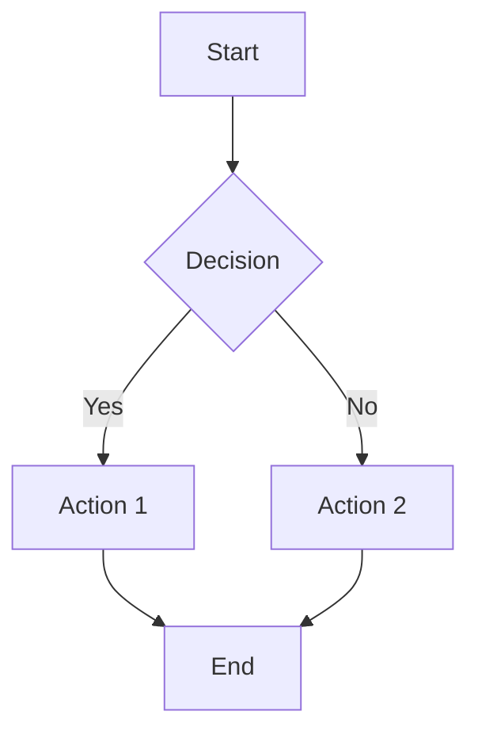
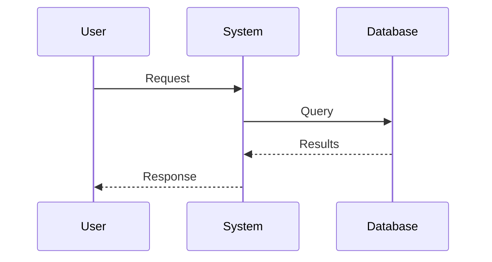
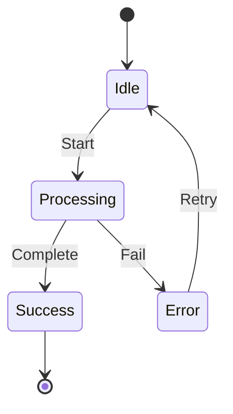
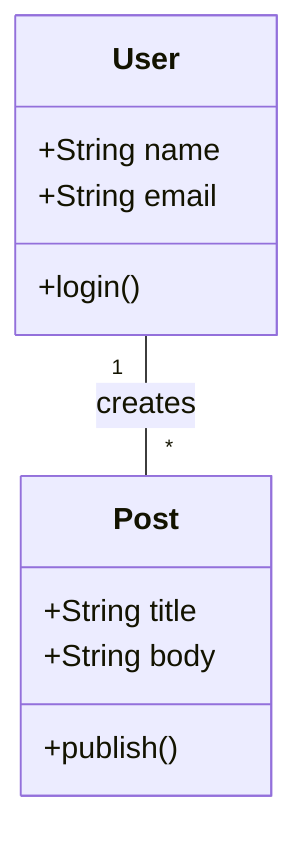

# Mermaid Diagram Templates

## Flowchart Template

Use for sequential processes, decision trees, and workflows.

## Sequence Diagram Template

Use for showing interactions between components over time.

## State Diagram Template

Use for showing state transitions in a process.

## Class Diagram Template

Use for showing structure of code or data models.

## Guidelines for Mermaid in Tutorials

1. **Keep it simple**: Only include essential elements
2. **Label clearly**: Use descriptive text for all nodes and edges
3. **Consistent styling**: Use the same colors/shapes for similar elements
4. **Size appropriately**: Don't make diagrams too large or complex
5. **Reference in text**: Always explain what the diagram shows in the surrounding text
6. **Alternative text**: Provide a textual description for accessibility

## Common Pitfalls to Avoid

- Overly complex diagrams with too many elements
- Inconsistent naming or labeling
- Missing start/end points in flowcharts
- Unclear decision points
- Diagrams that don't match the described process